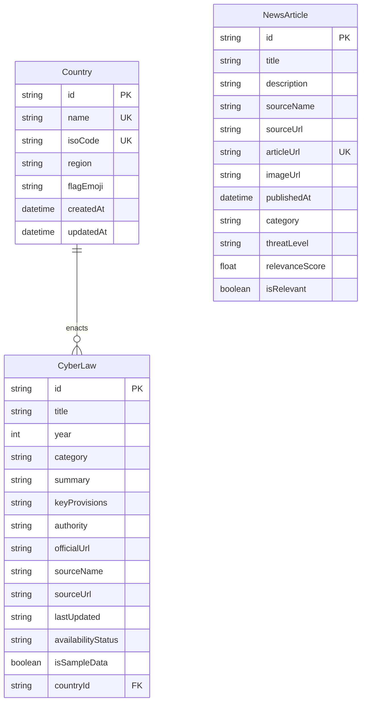

# 🌐 CyberLaw Atlas

> **Global Cybercrime & Cybersecurity Legal Intelligence Platform**  
> An interactive legal intelligence and comparative research system tracking statutory cybercrime legislation, data privacy regimes, cybersecurity frameworks, and real-time AI threat intelligence across **48 sovereign jurisdictions worldwide**.

[](https://nextjs.org/)
[](https://react.dev/)
[](https://www.typescriptlang.org/)
[](https://tailwindcss.com/)
[](https://www.prisma.io/)
[](https://www.sqlite.org/)
[](#-supported-jurisdictions)
[](#-database-schema--legal-data-architecture)

---

## 📑 Table of Contents

- [Overview](#-overview)
- [Key Features](#-key-features)
- [System Architecture](#-system-architecture)
- [Supported Jurisdictions](#-supported-jurisdictions)
- [AI Cybersecurity Threat Intelligence](#-ai-cybersecurity-threat-intelligence)
- [Database Schema & Data Pipeline](#-database-schema--data-pipeline)
- [API Reference](#-api-reference)
- [Getting Started](#-getting-started)
  - [Prerequisites](#prerequisites)
  - [Installation & Environment](#installation--environment)
  - [Database Setup & Seeding](#database-setup--seeding)
  - [Running the Application](#running-the-application)
- [NPM Scripts](#-npm-scripts)
- [License & Legal Disclaimer](#-license--legal-disclaimer)

---

## 🧭 Overview

**CyberLaw Atlas** provides structured, verified, and source-attributed legal intelligence at the intersection of international cybersecurity law, data protection governance, and emergent artificial intelligence risks. 

Designed for legal researchers, cybersecurity officers (CISOs), compliance teams, and policy analysts, the platform consolidates dispersed national statutes, official gazettes, and UNCTAD Cyberlaw Tracker taxonomies into a single, high-performance interface.

### Core Objectives

1. **Harmonized Legal Intelligence**: Standardize diverse national legal provisions into structured, searchable records with direct links to official gazettes and governing bodies.
2. **Instant Cross-Border Comparison**: Enable multi-nation side-by-side comparative matrices to evaluate regulatory differences in penalties, notification windows, and liability.
3. **Automated Threat-to-Law Context**: Monitor active threat advisories and AI security vulnerabilities mapped against legal and compliance frameworks without recurring API costs.

---

## ✨ Key Features

### 1. Global Jurisdiction Explorer (`/`)
- **Fast Interactive Search**: Search jurisdictions instantly by Country Name, ISO 3166-1 alpha-2 standard code (e.g. `IN`, `US`, `CN`, `GB`, `DE`, `JP`), or geographical region.
- **Quick-Access Hubs**: Instant filter pills for G7, APAC, EU, and emerging cybersecurity powerhouses.
- **High-Level Statistics**: Real-time counters showing total indexed jurisdictions, statutory cyber acts, and active threat advisories.

### 2. Comprehensive Jurisdiction Profiles (`/country/[code]`)
- **Statutory Details**: Deep dive into primary cybercrime acts, data protection regulations (e.g., GDPR, DPDP, LGPD, PIPL), and critical infrastructure security policies.
- **Structured Provisions**: Section-by-section breakdown of penalties, unauthorized access definitions, surveillance warrants, and breach disclosure timelines.
- **Institutional Oversight**: Direct attribution to enforcing bodies (e.g., CERT-In, CISA, CAC, BSI, NCSC, ANPD).
- **Official Provenance**: Verified citations linked to national legislation repositories and official gazettes.
- **In-Page Law Filtering**: Dynamic filtering by legal categories (Cybercrime, Data Privacy, Electronic Commerce, Critical Infrastructure, etc.) and keyword search.

### 3. Cross-Jurisdictional Comparative Matrix (`/compare`)
- **Side-by-Side Analysis**: Select and contrast cyber legislation across 2 or more nations simultaneously.
- **Domain Matrix Mapping**: Compare specific regulatory dimensions:
  - Primary cybercrime statutes & penalties
  - Data protection & privacy authorities
  - Critical Information Infrastructure (CII) directives
  - Mandatory incident reporting thresholds
- **Shareable Matrix State**: Full URL synchronization (e.g., `/compare?countries=IN,US,GB,DE`) for seamless collaboration.

### 4. AI Cybersecurity Threat Intelligence (`/ai-security-news`)
- **Emerging Threat Feeds**: Real-time RSS monitoring covering AI Agent security, LLM prompt injection, jailbreaks, deepfake fraud, and automated malware.
- **Zero-Cost Deterministic NLP**: Fast, rule-based categorization engine computing threat severity levels (`Low`, `Medium`, `High`, `Critical`) and relevance scores without expensive external AI API calls.
- **Authoritative Sources**: Syndicated from CISA Advisories, The Hacker News, BleepingComputer, SecurityWeek, and Krebs on Security.
- **Instant Feed Refresh**: On-demand sync button with immediate background categorization and database upserts.

### 5. Standardized Data Ingestion Pipeline (`lib/ingestion`)
- Schema-enforced ingestion module aligned with UNCTAD taxonomy standards for programmatic addition of new sovereign statutes.

---

## 🏛 Supported Jurisdictions

CyberLaw Atlas indexes **48 sovereign jurisdictions** spanning all 6 major continents with 100% legal coverage:

| Region | Count | Jurisdictions (ISO Alpha-2) |
|:---|:---:|:---|
| **Asia-Pacific** | 10 | 🇮🇳 India (`IN`), 🇨🇳 China (`CN`), 🇯🇵 Japan (`JP`), 🇰🇷 South Korea (`KR`), 🇸🇬 Singapore (`SG`), 🇲🇾 Malaysia (`MY`), 🇹🇭 Thailand (`TH`), 🇮🇩 Indonesia (`ID`), 🇵🇭 Philippines (`PH`), 🇻🇳 Vietnam (`VN`) |
| **Middle East** | 5 | 🇦🇪 United Arab Emirates (`AE`), 🇸🇦 Saudi Arabia (`SA`), 🇶🇦 Qatar (`QA`), 🇮🇱 Israel (`IL`), 🇹🇷 Türkiye (`TR`) |
| **Europe** | 17 | 🇬🇧 United Kingdom (`GB`), 🇩🇪 Germany (`DE`), 🇫🇷 France (`FR`), 🇮🇹 Italy (`IT`), 🇪🇸 Spain (`ES`), 🇳🇱 Netherlands (`NL`), 🇧🇪 Belgium (`BE`), 🇨🇭 Switzerland (`CH`), 🇸🇪 Sweden (`SE`), 🇳🇴 Norway (`NO`), 🇩🇰 Denmark (`DK`), 🇫🇮 Finland (`FI`), 🇵🇱 Poland (`PL`), 🇵🇹 Portugal (`PT`), 🇮🇪 Ireland (`IE`), 🇦🇹 Austria (`AT`), 🇬🇷 Greece (`GR`) |
| **Americas** | 8 | 🇺🇸 United States (`US`), 🇨🇦 Canada (`CA`), 🇲🇽 Mexico (`MX`), 🇧🇷 Brazil (`BR`), 🇦🇷 Argentina (`AR`), 🇨🇱 Chile (`CL`), 🇨🇴 Colombia (`CO`), 🇵🇪 Peru (`PE`) |
| **Africa** | 6 | 🇿🇦 South Africa (`ZA`), 🇳🇬 Nigeria (`NG`), 🇰🇪 Kenya (`KE`), 🇪🇬 Egypt (`EG`), 🇬🇭 Ghana (`GH`), 🇲🇦 Morocco (`MA`) |
| **Oceania** | 2 | 🇦🇺 Australia (`AU`), 🇳🇿 New Zealand (`NZ`) |

---

## 🛠 System Architecture

```
cyberlaw-atlas-workspace/
├── package.json                   # Workspace root (proxy scripts for dev & db)
└── ucp-adityass/                  # Main Next.js 16 Application
    ├── app/                       # Next.js App Router
    │   ├── page.tsx               # Global Atlas homepage & jurisdiction search
    │   ├── layout.tsx             # Root layout, theme provider & global navbar
    │   ├── country/[code]/        # Dynamic country legal profile & statute viewer
    │   ├── compare/               # Side-by-side multi-jurisdiction comparative engine
    │   ├── ai-security-news/      # Real-time AI threat intelligence feed
    │   └── api/                   # RESTful API endpoints
    │       ├── countries/         # Country listing and single-country endpoints
    │       ├── compare/           # Cross-border comparison API
    │       └── news/              # News querying and live RSS sync endpoints
    ├── components/                # Reusable UI component library
    │   ├── CountrySearch.tsx      # Fast debounce-assisted search & filter component
    │   ├── Header.tsx             # Responsive global navigation
    │   ├── Footer.tsx             # Footer & attribution details
    │   ├── LawCard.tsx            # Expandable statute card with official links
    │   ├── LawFilters.tsx         # Category and enactment timeline filters
    │   ├── StatsOverview.tsx      # Platform metrics banner
    │   └── IngestionBanner.tsx    # Data compliance & provenance banner
    ├── lib/                       # Core domain logic & utilities
    │   ├── prisma.ts              # Singleton Prisma client instance
    │   ├── country-utils.ts       # ISO code normalization & validation
    │   ├── news-classifier.ts     # Deterministic NLP classification & threat scoring
    │   ├── news-fetcher.ts        # RSS feed parser & multi-source aggregator
    │   └── ingestion/             # UNCTAD-compliant legal record ingestion engine
    ├── prisma/                    # Database models and seed scripts
    │   ├── schema.prisma          # Database schema (Country, CyberLaw, NewsArticle)
    │   └── seed.ts                # Full seed dataset (48 countries, 112+ laws, news)
    ├── scripts/                   # CLI verification and diagnostic tools
    │   ├── check-db.ts            # Rapid database count diagnostics
    │   └── verify-db.ts           # Automated 100% legal coverage verification
    └── types/                     # TypeScript definitions for legal data
```

---

## 🤖 AI Cybersecurity Threat Intelligence

The platform features an automated pipeline monitoring threats at the intersection of AI and InfoSec:

1. **RSS Feed Aggregation (`lib/news-fetcher.ts`)**:
   - Continuously monitors authoritative feeds: **CISA Advisories**, **The Hacker News**, **BleepingComputer**, **SecurityWeek**, and **Krebs on Security**.
2. **Deterministic NLP Classifier (`lib/news-classifier.ts`)**:
   - Evaluates articles against curated dual taxonomies for AI (LLMs, prompt injection, jailbreaks, deepfakes, autonomous agents) and cybersecurity (exploits, zero-days, backdoors, exfiltration).
   - Computes a mathematical **Relevance Score (0–100)** based on term frequency and high-signal compound phrases.
   - Assigns threat levels: `Critical` 🚨, `High` ⚠️, `Medium` 🟡, and `Low` ℹ️.
3. **On-Demand Synchronization (`POST /api/news/refresh`)**:
   - Triggers live feed retrieval, deduplication by article URL, classification, and database upserting directly from the web interface.

---

## 🗄 Database Schema & Legal Data Architecture

The application uses **Prisma ORM** with SQLite for local development (and zero-config migration to PostgreSQL/MySQL in production).

### Schema Models (`prisma/schema.prisma`)



### Statutory Categories Included
- `Cybercrime` (unauthorized access, malware distribution, system interference)
- `Data Protection` & `Privacy` (GDPR compliance, consent frameworks, cross-border transfers)
- `Cybersecurity` (national incident response, CERT mandates, minimum security standards)
- `Electronic Transactions` (digital signatures, e-commerce legal validity)
- `Digital Evidence` (admissibility, chain of custody for digital forensics)
- `Online Fraud` & `Financial Crime` (phishing, identity theft, illicit transactions)
- `Critical Infrastructure` (SCADA/ICS protection, essential services resilience)

---

## 🔌 API Reference

### 1. Jurisdictions & Cyber Laws

#### Get All Jurisdictions
```http
GET /api/countries
```
Returns list of all 48 supported countries with law counts and regions.

#### Get Jurisdiction by ISO Code or Name
```http
GET /api/countries/{code}
```
- **Path Parameter**: `{code}` (e.g. `IN`, `US`, `CN`, `Germany`)
- **Response**: Full country object with all associated statutory cyber laws, provisions, enforcing agencies, and official source links.

---

### 2. Legal Comparison Matrix

#### Comparative Matrix Lookup
```http
GET /api/compare?countries=IN,US,GB
```
- **Query Parameter**: `countries` (Comma-separated ISO codes or names)
- **Response**: Comparative matrix dataset grouped by legal category, with statutory cross-mapping.

---

### 3. AI Cybersecurity News & Threat Intelligence

#### Query News Articles
```http
GET /api/news?category=Prompt+Injection&threatLevel=High&limit=20
```
- **Query Parameters**:
  - `category` (optional): Filter by AI security category
  - `threatLevel` (optional): `Low`, `Medium`, `High`, `Critical`
  - `search` (optional): Free-text search query
  - `limit` (optional, default: `30`): Max articles returned

#### Refresh Live RSS Feeds
```http
POST /api/news/refresh
```
- Fetches all remote RSS feeds, executes classification, upserts novel articles, and returns sync statistics.

---

## 🚀 Getting Started

### Prerequisites

- **Node.js**: `v18.18.0` or later (Node.js 20+ recommended)
- **npm**: `v9.0.0` or later

### Installation & Environment

1. **Clone the repository**:
   ```bash
   git clone <repository-url>
   cd cyberlaw-atlas-workspace
   ```

2. **Install dependencies**:
   ```bash
   # From root workspace:
   npm --prefix ucp-adityass install

   # Or inside ucp-adityass:
   cd ucp-adityass
   npm install
   ```

3. **Configure Environment Variables**:
   Ensure `.env` exists inside `ucp-adityass/`:
   ```env
   DATABASE_URL="file:./dev.db"
   ```

### Database Setup & Seeding

The repository includes a comprehensive, idempotent seed script that populates all 48 countries, authentic legal statutes, and initial intelligence articles.

```bash
# Inside ucp-adityass:
npx prisma generate
npm run db:seed

# Verify 100% database coverage:
npm run db:verify
```

> **Verification Guarantee**: Running `npm run db:verify` audits all 48 jurisdictions and confirms that zero countries have missing cyber laws.

### Running the Application

```bash
# Run development server (from root or ucp-adityass):
npm run dev
```

Open [http://localhost:3000](http://localhost:3000) in your browser.

---

## 💻 NPM Scripts

| Command | Description |
|:---|:---|
| `npm run dev` | Starts the Next.js development server on `http://localhost:3000` |
| `npm run build` | Compiles and builds the production Next.js application |
| `npm run start` | Runs the compiled production server |
| `npm run lint` | Runs ESLint 9 validation across all project files |
| `npm run db:seed` | Seeds database with 48 jurisdictions, 112+ laws, and news |
| `npm run db:verify` | Verifies full legal coverage across all 48 jurisdictions |

---

## ⚖️ License & Legal Disclaimer

This project is open-source under the [MIT License](LICENSE).

**Legal Disclaimer**: The information provided in CyberLaw Atlas is compiled for academic, educational, and research purposes. While all laws and provisions are cross-referenced with official gazettes and statutory repositories, this platform does not constitute formal legal counsel. For binding legal opinions or regulatory compliance mandates, consult qualified legal professionals in the respective national jurisdiction.
