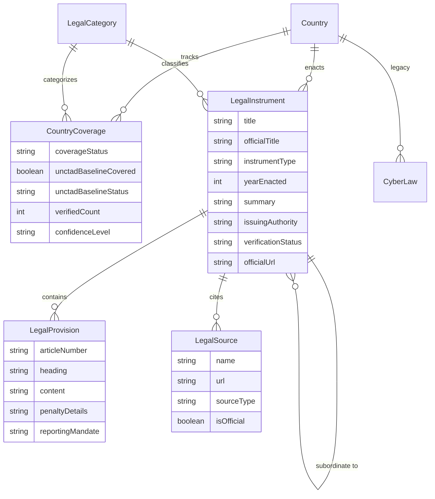

# 🌐 CyberLaw Atlas

> **Global Cybercrime & Cybersecurity Legal Intelligence Platform**  
> An interactive legal intelligence and comparative research system tracking statutory cybercrime legislation, data privacy regimes, cybersecurity frameworks, and real-time AI threat intelligence across **48 sovereign jurisdictions worldwide**.

[](https://nextjs.org/)
[](https://react.dev/)
[](https://www.typescriptlang.org/)
[](https://tailwindcss.com/)
[](https://www.prisma.io/)
[](https://www.sqlite.org/)
[](#-supported-jurisdictions)
[](#-database-schema--legal-data-architecture)
[](#-database-schema--legal-data-architecture)

---

## 📑 Table of Contents

- [Overview](#-overview)
- [Legal Data Methodology](#-legal-data-methodology--standards)
- [Key Features](#-key-features)
- [System Architecture](#-system-architecture)
- [Supported Jurisdictions](#-supported-jurisdictions)
- [AI Cybersecurity Threat Intelligence](#-ai-cybersecurity-threat-intelligence)
- [Database Schema & Data Pipeline](#-database-schema--data-pipeline)
- [API Reference](#-api-reference)
- [Getting Started](#-getting-started)
- [License & Legal Disclaimer](#-license--legal-disclaimer)

---

## 🧭 Overview

**CyberLaw Atlas** provides structured, verified, and source-attributed legal intelligence at the intersection of international cybersecurity law, data protection governance, and emergent artificial intelligence risks.

Designed for legal researchers, cybersecurity officers (CISOs), compliance teams, and policy analysts, the platform consolidates dispersed national statutes, official gazettes, and UNCTAD Cyberlaw Tracker taxonomies into a single, high-performance interface.

---

## ⚖️ Legal Data Methodology & Standards

CyberLaw Atlas operates on an empirical, research-backed methodology designed to avoid superficial "laws-per-country" quotas:

1. **No Artificial Targets**: A jurisdiction may have multiple statutes, criminal code provisions, sector-specific directives, and regulator circulars. The platform never treats 2–3 laws as "complete coverage".
2. **Transparent Coverage Modeling**: Missing records signify *"Not yet documented in CyberLaw Atlas"*, **never** *"No legislation exists"*.
3. **Dual-Layer Classification**:
   - **UNCTAD Baseline Indicators**: Benchmark tracking across the 5 core UNCTAD cyberlaw areas (E-Transactions, Data Protection, Cybercrime, Consumer Protection, Indirect Taxation).
   - **In-Depth Documented Legal Instruments**: Section-level legal instruments verified against official government gazettes.
4. **Methodology Documentation**:
   - [**Legal Data Audit Report** (`docs/legal-data-audit.md`)](./docs/legal-data-audit.md): Forensic audit of all 48 jurisdictions, category distributions, and identified gaps.
   - [**14-Step Research Workflow** (`docs/legal-data-research-workflow.md`)](./docs/legal-data-research-workflow.md): Standardized protocol and minimum evidence criteria for `VERIFIED` status.
   - [**Legal Research Backlog** (`docs/legal-data-backlog.md`)](./docs/legal-data-backlog.md): Systematic country-by-country backlog tracking unresearched sectors and secondary regulations.

---

## 🏛 Supported Jurisdictions

CyberLaw Atlas monitors **48 sovereign jurisdictions** spanning all 6 major continents with UNCTAD baseline alignment and transparent coverage tracking:

| Region | Count | Jurisdictions (ISO Alpha-2) |
|:---|:---:|:---|
| **Asia-Pacific** | 10 | 🇮🇳 India (`IN`), 🇨🇳 China (`CN`), 🇯🇵 Japan (`JP`), 🇰🇷 South Korea (`KR`), 🇸🇬 Singapore (`SG`), 🇲🇾 Malaysia (`MY`), 🇹🇭 Thailand (`TH`), 🇮🇩 Indonesia (`ID`), 🇵🇭 Philippines (`PH`), 🇻🇳 Vietnam (`VN`) |
| **Middle East** | 5 | 🇦🇪 United Arab Emirates (`AE`), 🇸🇦 Saudi Arabia (`SA`), 🇶🇦 Qatar (`QA`), 🇮🇱 Israel (`IL`), 🇹🇷 Türkiye (`TR`) |
| **Europe** | 17 | 🇬🇧 United Kingdom (`GB`), 🇩🇪 Germany (`DE`), 🇫🇷 France (`FR`), 🇮🇹 Italy (`IT`), 🇪🇸 Spain (`ES`), 🇳🇱 Netherlands (`NL`), 🇧🇪 Belgium (`BE`), 🇨🇭 Switzerland (`CH`), 🇸🇪 Sweden (`SE`), 🇳🇴 Norway (`NO`), 🇩🇰 Denmark (`DK`), 🇫🇮 Finland (`FI`), 🇵🇱 Poland (`PL`), 🇵🇹 Portugal (`PT`), 🇮🇪 Ireland (`IE`), 🇦🇹 Austria (`AT`), 🇬🇷 Greece (`GR`) |
| **Americas** | 8 | 🇺🇸 United States (`US`), 🇨🇦 Canada (`CA`), 🇲🇽 Mexico (`MX`), 🇧🇷 Brazil (`BR`), 🇦🇷 Argentina (`AR`), 🇨🇱 Chile (`CL`), 🇨🇴 Colombia (`CO`), 🇵🇪 Peru (`PE`) |
| **Africa** | 6 | 🇿🇦 South Africa (`ZA`), 🇳🇬 Nigeria (`NG`), 🇰🇪 Kenya (`KE`), 🇪🇬 Egypt (`EG`), 🇬🇭 Ghana (`GH`), 🇲🇦 Morocco (`MA`) |
| **Oceania** | 2 | 🇦🇺 Australia (`AU`), 🇳🇿 New Zealand (`NZ`) |

---

## 🛠 System Architecture

```
cyberlaw-atlas-workspace/
├── docs/                          # Comprehensive legal methodology documentation
│   ├── legal-data-audit.md        # Database forensic audit report
│   ├── legal-data-research-workflow.md # 14-step verified research protocol
│   └── legal-data-backlog.md      # Systematic research backlog across 48 nations
├── app/                           # Next.js App Router
│   ├── page.tsx                   # Atlas homepage, global search & coverage metrics
│   ├── country/[code]/            # Country profile with UNCTAD baseline & statutes
│   ├── compare/                   # Side-by-side comparative legal matrix
│   ├── ai-security-news/          # AI threat intelligence feed
│   └── api/                       # RESTful endpoints (/api/countries, /api/compare, /api/news)
├── components/                    # UI component library (LawCard, LawFilters, CountrySearch)
├── lib/                           # Core utilities & ingestion pipeline
├── prisma/                        # Database models and seed scripts
│   ├── schema.prisma              # Hierarchical schema (Country, Coverage, Instrument, Provision)
│   └── seed.ts                    # Idempotent 48-country seed script
└── scripts/                       # Verification and data quality tools
    ├── validate-legal-data.ts     # Data quality validation linter
    ├── verify-db.ts               # Database verification & audit reporter
    └── audit-db.ts                # Diagnostic audit script
```

---

## 🗄 Database Schema & Legal Data Architecture

CyberLaw Atlas organizes legal intelligence into a clean, hierarchical relational structure:

$$\text{Country} \longrightarrow \text{CountryCoverage} \longrightarrow \text{LegalCategory} \longrightarrow \text{LegalInstrument} \longrightarrow \text{LegalProvision} \ \& \ \text{LegalSource}$$



---

## 🔌 API Reference

### 1. Jurisdictions & Cyber Laws

#### Get All Jurisdictions
```http
GET /api/countries
```
Returns list of all 48 supported countries with law counts and regions.

#### Get Jurisdiction by ISO Code or Name
```http
GET /api/countries/{code}
```
- **Path Parameter**: `{code}` (e.g. `IN`, `US`, `CN`, `Germany`)
- **Response**: Full country object with all associated statutory cyber laws, provisions, enforcing agencies, and official source links.

---

### 2. Legal Comparison Matrix

#### Comparative Matrix Lookup
```http
GET /api/compare?countries=IN,US,GB
```
- **Query Parameter**: `countries` (Comma-separated ISO codes or names)
- **Response**: Comparative matrix dataset grouped by legal category, with statutory cross-mapping.

---

### 3. AI Cybersecurity News & Threat Intelligence

#### Query News Articles
```http
GET /api/news?category=Prompt+Injection&threatLevel=High&limit=20
```
- **Query Parameters**:
  - `category` (optional): Filter by AI security category
  - `threatLevel` (optional): `Low`, `Medium`, `High`, `Critical`
  - `search` (optional): Free-text search query
  - `limit` (optional, default: `30`): Max articles returned

#### Refresh Live RSS Feeds
```http
POST /api/news/refresh
```
- Fetches all remote RSS feeds, executes classification, upserts novel articles, and returns sync statistics.

---

## 🚀 Getting Started

### Prerequisites

- **Node.js**: `v18.18.0` or later (Node.js 20+ recommended)
- **npm**: `v9.0.0` or later

### Installation & Environment

1. **Clone the repository**:
   ```bash
   git clone <repository-url>
   cd cyberlaw-atlas-workspace
   ```

2. **Install dependencies**:
   ```bash
   # From root workspace:
   npm --prefix ucp-adityass install

   # Or inside ucp-adityass:
   cd ucp-adityass
   npm install
   ```

3. **Configure Environment Variables**:
   Ensure `.env` exists inside `ucp-adityass/`:
   ```env
   DATABASE_URL="file:./dev.db"
   ```

### Database Setup & Seeding

The repository includes a comprehensive, idempotent seed script that populates all 48 countries, authentic legal statutes, and initial intelligence articles.

```bash
# Inside ucp-adityass:
npx prisma generate
npm run db:seed

# Verify 100% database coverage:
npm run db:verify
```

> **Verification Guarantee**: Running `npm run db:verify` audits all 48 jurisdictions and confirms that zero countries have missing cyber laws.

### Running the Application

```bash
# Run development server (from root or ucp-adityass):
npm run dev
```

Open [http://localhost:3000](http://localhost:3000) in your browser.

---

## 💻 NPM Scripts

| Command | Description |
|:---|:---|
| `npm run dev` | Starts the Next.js development server on `http://localhost:3000` |
| `npm run build` | Compiles and builds the production Next.js application |
| `npm run start` | Runs the compiled production server |
| `npm run lint` | Runs ESLint 9 validation across all project files |
| `npm run db:seed` | Seeds database with 48 jurisdictions, 112+ laws, and news |
| `npm run db:verify` | Verifies full legal coverage across all 48 jurisdictions |

---

## ⚖️ License & Legal Disclaimer

This project is open-source under the [MIT License](LICENSE).

**Legal Disclaimer**: The information provided in CyberLaw Atlas is compiled for academic, educational, and research purposes. While all laws and provisions are cross-referenced with official gazettes and statutory repositories, this platform does not constitute formal legal counsel. For binding legal opinions or regulatory compliance mandates, consult qualified legal professionals in the respective national jurisdiction.
