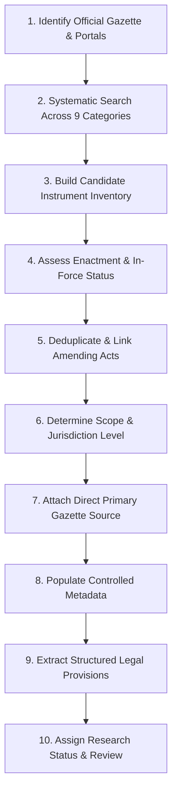

# CyberLaw Atlas — Legal Instrument Discovery Policy & Coverage Methodology

**Document Version:** 2.0  
**Effective Date:** September 8, 2026  
**Audience:** Legal Researchers, Data Engineers, Open-Source Contributors, Platform Auditors

---

## 1. Core Purpose & Objective

The objective of CyberLaw Atlas is to provide an empirical, exhaustive, and legally authoritative repository of cybercrime, cybersecurity, and digital economy legislation across all 48 monitored jurisdictions.

For every jurisdiction, the platform aims to identify **all relevant enacted legal instruments** within the defined scope, rejecting the artificial practice of adding only one or two "representative" laws per category or setting arbitrary law count quotas.

---

## 2. Typology of Admissible Legal Instruments

An admissible legal instrument is an enforceable norm issued by a competent sovereign or supranational authority. To maintain conceptual clarity and avoid legal distortion, instruments are categorized under a controlled typology:

| Typology Code | Instrument Type | Description & Examples |
|:---|:---|:---|
| `ACT` | **Primary Statutory Act** | Enacted by a sovereign parliament or congress (e.g., *UK Computer Misuse Act 1990*, *India Information Technology Act, 2000*, *Singapore Cybersecurity Act 2018*). |
| `CODE_PROVISION` | **Penal/Civil Code Segment** | Specific chapters, titles, or articles within a consolidated national code (e.g., *Title 18 U.S.C. § 1030*, *German Strafgesetzbuch §§ 202a–202d*, *French Code Pénal Arts. 323-1 to 323-7*). |
| `LAW` | **Statutory Law** | Formal statutory enactment in civil law jurisdictions (e.g., *Spain Ley Orgánica 3/2018*, *Egypt Law No. 175 of 2018*). |
| `DECREE` | **Executive / Royal Decree** | Promulgated by a Head of State or Council of Ministers with statutory force (e.g., *Saudi Royal Decree No. M/19*, *UAE Federal Decree-Law No. 34 of 2021*). |
| `REGULATION` | **Subordinate / Delegated Regulation** | Binding rules promulgated by government ministries or executive bodies pursuant to statutory delegation. |
| `RULE` | **Administrative Rules** | Secondary procedural or substantive rules enacted under statutory rule-making powers (e.g., *India IT Intermediary Rules, 2021*). |
| `DIRECTIVE` | **Binding Regulatory Directive** | Binding regulatory orders issued by statutory agencies or regulators (e.g., *CERT-In Directions, 2022*, *EU NIS2 Directive 2022/2555*). |
| `SECTOR_REGULATION` | **Sector-Specific Binding Rule** | Enforceable rules issued by sectoral authorities for banking, telecommunications, healthcare, or energy (e.g., *RBI Master Direction on Digital Payment Security Controls*). |
| `ORDINANCE` | **Executive Ordinance** | Temporary emergency legislative instruments promulgated when parliament is in recess. |
| `NOTIFICATION` | **Official Gazette Notification** | Formal gazetted instruments bringing statutory provisions into force or notifying appointments. |
| `TREATY` | **International Convention / Treaty** | Multilateral conventions ratified by the jurisdiction (e.g., *Council of Europe Budapest Convention on Cybercrime (CETS No. 185)*). |

### Strict Anti-Fragmentation Rule
> [!IMPORTANT]
> **Sections, articles, clauses, and sub-rules within an instrument must NOT be created as separate instrument records.**
> Specific articles (e.g., Section 43, Article 83, Rule 3(1)(b)) must be recorded as `LegalProvision` entities linked to their parent `LegalInstrument`.

### Amending Acts vs. Consolidated Statutes Rule
- Where an amending act alters an existing principal statute, the principal statute must be recorded as the primary instrument, with `amendmentStatus = "AMENDED"` or `"CONSOLIDATED"`.
- Do not create separate instrument entries for routine annual amendments unless the amending statute created an autonomous statutory framework with an independent citation.

---

## 3. The 10-Step Legal Discovery Workflow

Every jurisdiction must be investigated using this standardized 10-step protocol:

### Step 1: Identify Official Legal & Government Sources
Identify the jurisdiction's authoritative gazette, parliament site, and regulatory repositories:
- National Gazette (e.g., *The Gazette of India*, *Federal Register of Legislation*, *Journal Officiel de la République Française*, *Boletín Oficial del Estado*).
- National Parliamentary Code Repositories (e.g., *India Code*, *Legislation.gov.uk*, *Gesetze im Internet*, *InfoLEG*).
- Sectoral Regulators (e.g., Central Banks, Telecom Regulators, Data Protection Authorities, National Cybersecurity Agencies).

### Step 2: Systematic Search Across All 9 Taxonomy Categories
A thorough search must be conducted across all 9 defined project areas:
1. **Cybercrime**: Unauthorized access, data interference, system disruption, malware distribution, interception, cyber terrorism.
2. **Data Protection and Privacy**: Personal data processing, data subject rights, consent, data fiduciary obligations, cross-border data transfer.
3. **Cybersecurity Framework**: National cybersecurity strategies, CSIRT/CERT mandates, incident notification windows, network security obligations.
4. **Electronic Transactions & E-Commerce**: Legal recognition of electronic records, digital signatures, PKI, electronic contracts.
5. **Digital Evidence & Forensics**: Statutory rules for admissibility, preservation orders, production of electronic records, digital forensics certificates.
6. **Online Fraud and Financial Cybercrime**: Electronic banking fraud, phishing, digital payment security, payment spoofing, identity theft.
7. **Critical Infrastructure Protection**: Identification of CII / SCADA sectors, operator obligations, sector resilience audits.
8. **Online Consumer Protection**: Digital marketplace rules, unfair digital practices, dark patterns, consumer dispute redressal.
9. **Digital Economy & Indirect Taxation**: Tax collection at source (TCS) on e-commerce, digital equalization levies, digital services tax.

### Step 3: Build Candidate Legal-Instrument Inventory
Compile candidate instruments into a jurisdictional research sheet. Every candidate must note:
- Initial title and year
- Discovering source
- Initial suspected category

### Step 4: Check Legal Enactment & In-Force Status
Determine the legal lifecycle status:
- `IN_FORCE`: Currently valid, fully enacted, and enforceable.
- `PENDING_ENFORCEMENT`: Passed by parliament/promulgated, but awaiting appointed date of enforcement notification.
- `REPEALED`: Replaced by newer legislation (e.g., Indian Evidence Act 1872 replaced by Bharatiya Sakshya Adhiniyam 2023 on July 1, 2024).
- `AMENDED`: In force as amended by subsequent statutes.
- `PROPOSED`: Draft bills currently before parliament.
- `OUT_OF_SCOPE`: Evaluated but excluded due to lack of enforceable legal character.

### Step 5: Deduplicate Instruments
Resolve duplicate titles, bilingual variations, and conflated entries. Ensure subordinate rules are linked to their authorizing parent statutes via `parentInstrumentId`.

### Step 6: Determine Scope & Jurisdiction Level
Classify geographic and jurisdictional reach:
- `NATIONAL`: Applies across the entire sovereign territory.
- `FEDERAL`: Federal statute in a federated system (e.g., US Title 18, Canadian Criminal Code).
- `STATE_PROVINCIAL`: Sub-national statute (e.g., California CCPA, New York SHIELD Act).
- `SECTORAL`: Applies exclusively to a specific regulated industry (e.g., Banking, Healthcare, Telecommunications).
- `REGIONAL_SUPRANATIONAL`: Directives or regulations of supranational bodies (e.g., EU GDPR, NIS2).

### Step 7: Attach Direct Official Source Wherever Possible
- **Direct Official Source**: URL linking directly to the full-text enactment PDF or legislative slug (e.g., `https://www.legislation.gov.uk/ukpga/1990/18/contents`).
- **Generic Portal**: URL linking only to a homepage or directory. If only a generic portal is available, the record cannot receive `INDEPENDENTLY_VERIFIED` status until a direct source is attached.

### Step 8: Record Controlled Metadata
Populate all required schema attributes:
- `officialTitle`: Official vernacular or statutory long title.
- `shortTitle`: Standard statutory short title or acronym.
- `enactmentDate`: Date of presidential assent, royal assent, or legislative passage.
- `effectiveDate`: Date of entry into force.
- `issuingAuthority`: Ministry, parliament, or regulatory commission.
- `scope`: Geographic / industry reach.
- `inclusionExclusionNotes`: Methodological justification for inclusion.

### Step 9: Extract Structured Provisions from Primary Legal Text
Provisions must be extracted **strictly from the authoritative statutory text or official gazette**:
- `articleNumber`: Specific section, article, or rule number (e.g., "Section 66F", "Article 83(5)", "Rule 3(1)(b)").
- `heading`: Official statutory clause title.
- `content`: Substantive legal obligation or prohibition.
- `penaltyDetails`: Explicit statutory sanctions, custodial sentences, and fine ranges.
- `reportingMandate`: Explicit notification windows (e.g., "within 6 hours", "within 72 hours").

### Step 10: Assign Research Status & Review Flag
Set the lifecycle tracking status:
- `CANDIDATE`: Identified by keyword or secondary reference, awaiting source inspection.
- `RESEARCHED`: Authoritative source examined; metadata compiled.
- `SOURCE_FOUND`: Official gazette or repository URL attached.
- `INDEPENDENTLY_VERIFIED`: Legal identity, in-force status, provisions, and direct gazette verified by researcher.
- `NEEDS_REVIEW`: Flagged for disambiguation, dead URL, or amended text.
- `OUT_OF_SCOPE`: Investigated and rejected.

---

## 4. Controlled Status Vocabularies

### Instrument Research Statuses
- `CANDIDATE`
- `RESEARCHED`
- `SOURCE_FOUND`
- `INDEPENDENTLY_VERIFIED`
- `NEEDS_REVIEW`
- `REPEALED`
- `PROPOSED`
- `OUT_OF_SCOPE`

### Verification Statuses
- `VERIFIED`: Verified against primary gazette text.
- `NEEDS_REVIEW`: Default status for all migrated prototype records.
- `IN_PROGRESS`: Currently being researched under active task.
- `REJECTED`: Invalid or fabricated title.

---

## 5. Unequal Counts Across Jurisdictions Principle

> [!CAUTION]
> **Do not expect or enforce identical instrument counts across countries.**
> 
> The number of applicable cyber laws naturally varies by legal architecture:
> - **India**: High count due to specialized IT Act, new criminal codes (BNS, BNSS, BSA), sectoral RBI directions, CERT-In directions, and dedicated consumer e-commerce rules.
> - **United States**: High count due to sectoral fragmentation (HIPAA, GLBA, COPPA, CISA, CFAA, ECPA, CCPA).
> - **Unitary Code Nations**: Moderate count where cyber offences are integrated into a single penal code and data protection is governed by a unified national act.
> - **Small Jurisdictions**: Low count where secondary regulations do not exist and reliance is placed on regional frameworks.
> 
> **Rule:** Every low count must be justified by an explanatory research note in `CountryCoverage.researchNotes`, never hidden or artificially inflated with duplicate entries.
